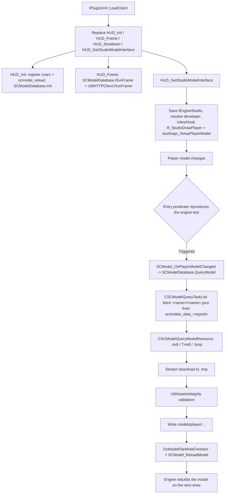

# SCModelDownloader

SCModelDownloader is an automatic player-model download plugin for the Sven Co-op client. By taking
over the `HUD_*` exports and the `SetupPlayerModel` call chain, it starts asynchronous download tasks
when a player's model changes, validates and writes the model assets, then hot-reloads the player
model. It also adds GameUI settings and task pages plus a prompt to switch to a newer model version.

## Provenance

This repository is the standalone SCModelDownloader plugin, extracted from MetaHookSv
(`Plugins/SCModelDownloader/`) into its own CMake workspace, aligned with the standalone Renderer,
PrecacheManager and HeapPatch projects. This note was migrated from MetaHookSv
`memory/SCModelDownloader.md` and adapted to the new layout: plugin sources moved to `src/`, the
`.vcxproj` / `MetaHook.sln` / `plugins_svencoop.lst` integration was replaced by CMake plus a
self-owned gamedata catalog, and the UI/layout/localization assets moved to
`assets/svencoop/scmodeldownloader/`. The symbol-by-symbol inventory that the source note links as
`scmodeldownloader-privatevars` remains in the source repository
(`memory/privatevars/scmodeldownloader-privatevars.md`, `metahooksv` project) and is summarized here.
The `metahooksv` Basic Memory project belongs to the source repository; notes here use the
`scmodeldownloader` project and the `scmodeldownloader/` permalink prefix.

## Responsibilities and entry points

- `src/plugins.cpp`: `IPluginsV4` lifecycle. `LoadEngine` checks the host API version, collects the
  file system (`FileSystem` or `FileSystem_HL25`), engine type/buildnum and `g_EngineDLLInfo.ImageBase`,
  copies `cl_enginefunc_t`, resolves the private symbols, registers the DLL-load notification, then
  runs `VGUI2Extension_Init()` and the BaseUI / GameUI hook installation. `LoadClient` replaces
  `HUD_Init`, `HUD_Shutdown`, `HUD_Frame` and `HUD_GetStudioModelInterface` and initializes the HTTP
  and integrity clients; `ExitGame` uninstalls the UI hooks; `Shutdown` unregisters the notification.
- `src/exportfuncs.cpp`: the replaced `HUD_*` bodies, cvar/command registration, the two player-model
  handlers and the engine trigger predicate.
- `src/privatehook.cpp`: the five gamedata symbols, the `serverbrowser.dll` IAT hook, and the
  hook install/uninstall pair.
- `src/SCModelDatabase.cpp`, `src/SCModelDatabase.h`: task queue, query state machine, model/version
  databases, skipped-model list and the callback interfaces (`ISCModelQuery`,
  `ISCModelQueryStateChangeHandler`, `ISCModelLocalPlayerModelChangeHandler`, `ISCModelDatabase`).
- `src/BaseUI.cpp`, `src/GameUI.cpp`, `src/SCModelDownloaderDialog.*`,
  `src/SCModelDownloaderSettingsPage.*`, `src/TaskListPage.*`, `src/TaskListPanel.*`: the VGUI2
  settings page, task list and prompts.
- `src/UtilHTTPClient.*`, `src/UtilAssetsIntegrity.*`, `src/VGUI2ExtensionImport.*`,
  `src/UtilAutoPtr.h`: runtime-dependency loading and interface plumbing.

Console surface:

| Name | Default | Meaning |
| --- | --- | --- |
| `scmodel_autodownload` | `1` | Trigger downloads automatically on a model change. |
| `scmodel_downloadlatest` | `1` | Prefer the latest version when a model has several. |
| `scmodel_cdn` | `0` | `0` = GitHub, `1` = jsDelivr CDN. |
| `scmodel_max_retry` | `3` | Retry limit per task; `0` retries without limit. |
| `scmodel_reload` | — | Command: reload every player model. |

## Architecture

Layer breakdown:

1. **Entry and hook layer** (`plugins.cpp`, `exportfuncs.cpp`, `privatehook.cpp`). `LoadEngine` →
   `Engine_FillAddress()` resolves everything from gamedata; the two caller hooks are installed later
   from `HUD_GetStudioModelInterface`, after `IEngineStudio` has been copied and `developer` fetched,
   so no handler can run against an uninitialized studio interface.
2. **Download and state-machine layer** (`SCModelDatabase.cpp`). `CSCModelDatabase` owns the query
   list and the databases. Task classes: `CSCModelQueryDatabase` (`models.json`),
   `CSCModelQueryVersions` (`versions.json`), `CSCModelQueryTaskList` (per-model manifest) and
   `CSCModelQueryModelResource` (one asset file). States: `SCModelQueryState_Querying` → `Receiving`
   → `Finished` / `Failed`.
3. **UI and interaction layer** (`GameUI.cpp` plus the dialog/page classes). Displays task status,
   exposes the settings, and prompts the local player to switch to the latest version or skip it.

Hook behavior:

- Both handlers rebuild the engine's model-change predicate at the caller entry, before the engine
  mutates `DM_PlayerState`: `usesNamedModel = (developer.value || !Host_IsSinglePlayerGame()) &&
  players[i].model[0]`, then either `strcmp(DM_PlayerState[i].name, modelName) != 0` or
  `DM_PlayerState[i].model != currentEntity->model`. The `currentEntity` used for the comparison is
  snapshotted at entry through `IEngineStudio.GetCurrentEntity()`.
- `R_StudioDrawPlayer` derives the index as `pplayer->number - 1` (not `currententity->index`), keeps
  the engine's bound semantics — outside `[0, GetMaxClients())` it evaluates no predicate and starts
  no query — and calls the trampoline exactly once, returning its value unchanged. The query runs
  after the original call, reading the state the caller just wrote (`model == currentEntity->model ||
  !model`, then a non-empty `name[0]`).
- `studioapi_SetupPlayerModel` uses its parameter index directly, as the engine contract already
  requires a valid index.
- `Engine_InstallHook` installs both inline hooks and, if either fails, uninstalls both and aborts
  with `Sys_Error`.
- `SCModel_ReloadModel` / `SCModel_ReloadAllModels` clear `DM_PlayerState[i].name[0]` and `model` to
  make the engine reload the model on the next draw.

Symbols and ABI contract (gamedata-only, no signature search):

| Item | Kind | Use |
| --- | --- | --- |
| `R_StudioDrawPlayer` | function | Inline-hooked; passes through with the trampoline. |
| `studioapi_SetupPlayerModel` | function | Inline-hooked; passes through with the trampoline. |
| `Host_IsSinglePlayerGame` | function | Short-circuit operand of the trigger predicate. |
| `DM_PlayerState` | global | `player_model_t[MAX_CLIENTS]`, element stride `0x20C`. |
| `cl_players_model` | global | The `cl.players[0].model` member address; the array head is recovered by subtracting `offsetof(player_info_t, model)` (`0x130`). |

`player_info_sc_t` (SvEngine) is asserted to be `0x250` bytes at compile time; only the
`ENGINE_SVENGINE` branch is exercised by the shipped configuration.

## Dependencies

- **MetaHook API**: `ResolveGameSymbol` (FUNCTION and GLOBAL kinds), `GetModuleCRC64`,
  `GetGameSymbolStatusString`, `InlineHook` / `UnHook`, `RegisterLoadDllNotificationCallback` /
  `UnregisterLoadDllNotificationCallback`, `ModuleHasImport` / `ModuleHasImportEx`, `IATHook`,
  `GetEngineType`, `GetEngineBuildnum`, `GetEngineBase`, `SysError`, and `Sys_LoadModule` for the
  runtime DLLs. `src/privatehook.cpp` carries `static_assert(METAHOOK_API_VERSION >= 109, ...)`;
  `LoadEngine` additionally rejects a host API older than the SDK constant.
- **Engine interfaces**: `cl_enginefunc_t` (`pfnRegisterVariable`, `pfnAddCommand`, `COM_LoadFile`,
  `COM_FreeFile`, `Con_Printf` / `Con_DPrintf`, `GetAbsoluteTime`, `GetMaxClients`),
  `engine_studio_api_t` (`GetCurrentEntity`, `GetCvar`), `cl_exportfuncs_t`.
- **Runtime DLLs**: `UtilHTTPClient_libcurl.dll` (preferred) with `UtilHTTPClient_SteamAPI.dll` as
  fallback, `UtilAssetsIntegrity.dll` (validates downloaded files before they are written) and
  `VGUI2Extension.dll` (required to register the UI callbacks; without it the settings page, task
  list and upgrade prompt are not registered). All are loaded through `Sys_LoadModule` and fail with
  `Sys_Error` diagnostics.
- **Build-time sources (headers only, never configured or built)**: MetaHook, VGUI2Extension,
  UtilAssetsIntegrity, UtilHTTPClient, RapidJSON and ScopeExit, each pinned by commit in
  `cmake/Dependencies.cmake`; the interface repositories precede the MetaHook SDK on the include path.
  No Capstone and no `steam_api` link.
- **Network endpoints**: `models.json` from `raw.githubusercontent.com/wootguy/pmodels/master/database/sc/models.json`,
  `versions.json` from `raw.githubusercontent.com/wootguy/scmodels/master/database/sc/versions.json`,
  per-model manifests and assets from `wootdata.github.io/scmodels_data_<repoId>/models/player/...`;
  `scmodel_cdn=1` switches all three to `cdn.jsdelivr.net`.
- **Local data**: `scmodeldownloader/models.json`, `scmodeldownloader/versions.json`,
  `scmodeldownloader/skippedmodels.txt`, downloaded output under `models/player/<name>/`, and the
  bundled `assets/svencoop/scmodeldownloader/` (UI `.res` layouts, `gameui_english.txt` /
  `gameui_schinese.txt`, a seed `models.json` / `versions.json`).

## Repository layout

- `src/plugins.cpp`, `src/plugins.h` — plugin lifecycle and shared globals.
- `src/exportfuncs.cpp`, `src/exportfuncs.h` — replaced `HUD_*` exports and the model-change pipeline.
- `src/privatehook.cpp`, `src/privatehook.h` — gamedata resolution, hooks and the ABI assertions.
- `src/SCModelDatabase.cpp`, `src/SCModelDatabase.h` — query tasks, databases, callbacks.
- `src/BaseUI.cpp`, `src/GameUI.cpp`, `src/SCModelDownloaderDialog.*`,
  `src/SCModelDownloaderSettingsPage.*`, `src/TaskListPage.*`, `src/TaskListPanel.*` — VGUI2 UI.
- `src/UtilHTTPClient.*`, `src/UtilAssetsIntegrity.*`, `src/VGUI2ExtensionImport.*` — dependency access.
- `assets/svencoop/scmodeldownloader/` — UI layouts, localization and the bundled database files.
- `CMakeLists.txt`, `cmake/Sources.cmake` (explicit compile list), `cmake/Dependencies.cmake`,
  `cmake/VCLTL.cmake` — build.
- `scripts/build-SCModelDownloader-x86-{Debug,Release}.bat` — configure/build/install entry points.
- `scripts/manifests/scmodeldownloader.json`, `scripts/sync-gamedata.py`,
  `scripts/validate-gamedata.py` — gamedata synchronization and validation.
- `README.md`, `README.zh-CN.md` — install, console variables and build documentation. There is no
  test suite.

## Build and data flow

`scripts/build-SCModelDownloader-x86-{Debug,Release}.bat` → CMake (Visual Studio 17 2022,
`-A Win32`) → compile the DLL → install. The build uses MSVC x86 / C++20 and a static CRT with VC-LTL
5.3.1; `cmake/Sources.cmake` preserves the original 13 plugin and 105 SDK compilation units
(SourceSDK core, mathlib, tier0/1, vstdlib and `vgui_controls`), and no dependency project is built.
`scripts/manifests/scmodeldownloader.json` → `scripts/sync-gamedata.py` → pruned catalog under
`build/x86/<Configuration>/assets/svencoop/metahook/gamedata/scmodeldownloader`, validated before the
plugin target builds; disable with `-DSCMODELDOWNLOADER_SYNC_GAMEDATA=OFF`. The catalog declares the
five symbols above for the `svencoop-10257` and `svencoop-8948` snapshots only.
Install output is `install/x86/<Configuration>/svencoop/` containing
`metahook/plugins/SCModelDownloader.dll` (+ PDB), `metahook/gamedata/scmodeldownloader/` and the
`scmodeldownloader/` assets; nothing is deployed into the game automatically.

## Notes

- `models.json` and `versions.json` are read from `scmodeldownloader/` at `Init`; when a local file is
  missing the corresponding query (`BuildQueryDatabase` / `BuildQueryVersions`) is started
  automatically, and the downloaded payload is written back to that local path through a `.tmp` file.
- The model repository is sharded: `repoId = SCModel_Hash(lowerName) % 32`, where the hash is
  `hash = ((hash << 5) - hash) + ch` reduced modulo `15485863` at each step. A per-model manifest
  `<name>.json` is fetched from `scmodels_data_<repoId>`, and the assets are `.mdl`, `T.mdl` /
  `t.mdl` (both spellings are requested when the manifest reports a `T` model) and `.bmp`.
- Failed tasks retry after a fixed 5 seconds (`m_flNextRetryTime`), bounded by `scmodel_max_retry`
  (`3` by default; `0` means unlimited), so transfers survive short network instability.
- A comment in `BuildQueryList` records that a model query may fail before the database becomes
  available and must be triggered again after later database tasks complete.
- `GetNewerVersionModel` returns the `c_str()` of an internal `std::string` in the version mapping;
  callers must treat it as a short-lived pointer and must not cache it.
- `IsModelSkipped` / `AddSkippedModel` back the "skip this model" choice with
  `scmodeldownloader/skippedmodels.txt`.
- The `serverbrowser.dll` hook is a workaround for Sven Co-op calling
  `steam_api.dll!SteamAPI_Shutdown` inside `CVGUIModule::Shutdown`, which would kill the Steam API
  before the client's own `HUD_Shutdown`; the import is redirected to an empty local function. It is
  installed from the DLL-load notification and skipped when the module imports `steam_api.dll`
  without importing that specific symbol.
- Several UI callbacks (`Start` / `Shutdown` / `RunFrame` and friends) are empty stubs; the working
  functionality is concentrated in the KeyValues / TaskBar callbacks and the database callbacks.
- Symbol resolution is fatal and specific: a non-`MH_GAMESYMBOL_OK` status prints
  `Failed to resolve "<symbol>"` with buildnum, CRC64 (when available) and the status string instead
  of a bare "Could not found", and the plugin has no scan fallback.
- Only the SvEngine (`cl_players_sc`) path is ABI-verified end to end; the plugin ships enabled only
  for Sven Co-op, so the GoldSrc `cl_players` branch is not exercised by the shipped configuration.

## Callers (optional)

- The host MetaHook loader drives `Init` / `LoadEngine` / `LoadClient` / `ExitGame` / `Shutdown`,
  loading `metahook/plugins/SCModelDownloader.dll` from `plugins.lst`.
- The client export chain calls the replaced `HUD_Init`, `HUD_Frame`, `HUD_Shutdown` and
  `HUD_GetStudioModelInterface`.
- The engine render path reaches the handlers through `R_StudioDrawModel` → `R_StudioDrawPlayer`
  (including the `deadplayer` path) and through client-DLL calls to `studioapi_SetupPlayerModel`.
- UI call chain: `CTaskListPage` refreshes through `RegisterQueryStateChangeCallback` + `EnumQueries`;
  `CSCModelDownloaderSettingsPage` calls `BuildQueryDatabase` / `BuildQueryVersions` for a forced
  update; `CSCModelLocalPlayerModelChangeHandler` calls `GetNewerVersionModel` / `QueryModel` /
  `AddSkippedModel`.
- The host launcher merges `metahook/gamedata/scmodeldownloader` into its gamedata catalog.

## External documentation

`README.md` is the English landing page and `README.zh-CN.md` the Chinese one; they cover the
dependency DLLs, console variables, build variables and gamedata. The engine-private symbol
inventory lives in the source repository's `memory/privatevars/scmodeldownloader-privatevars.md`.
